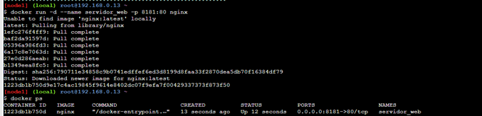
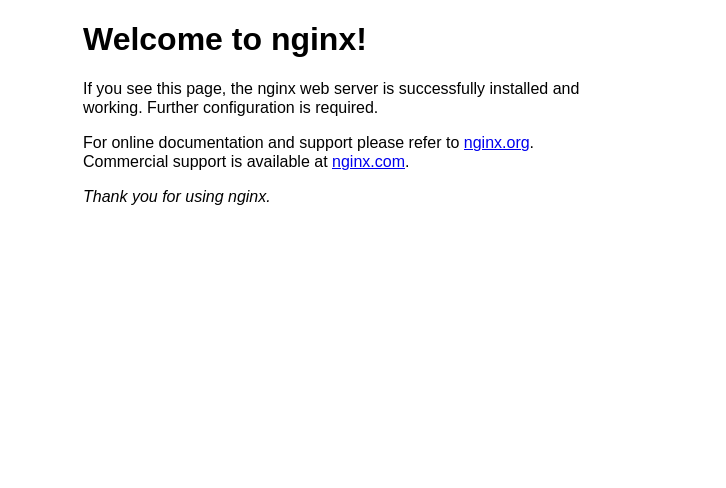
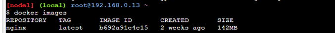
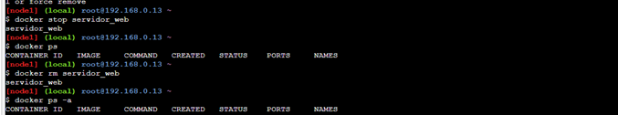

# Pantallazos del ejercicio

1. Creación del contenedor
   
2. Acceso al servidor web utilizando un navegador web
   
3. Imágenes en registro local
   
4. Eliminar el contenedor
   
5. <ul><li>- [x] <a href=https://github.com/lauramosdim/BootcampDevopsRoxanna/blob/master/Clase4Docker/bootcamp-3-challenge/reto1/crearContenedorNginx.sh target=_blank>Script</a></li></ul>
