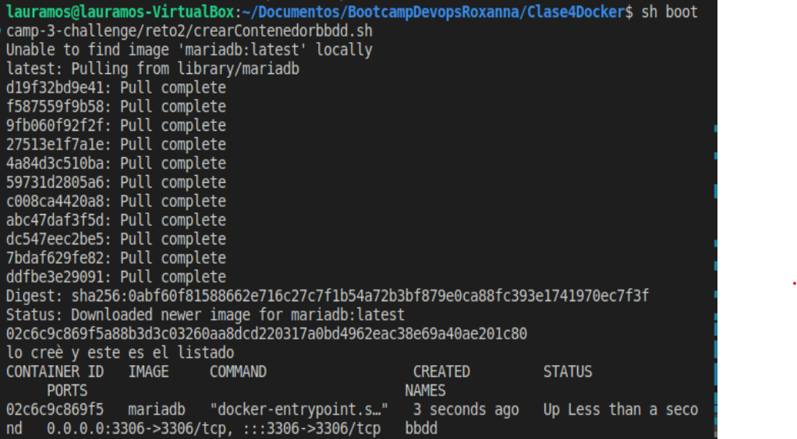
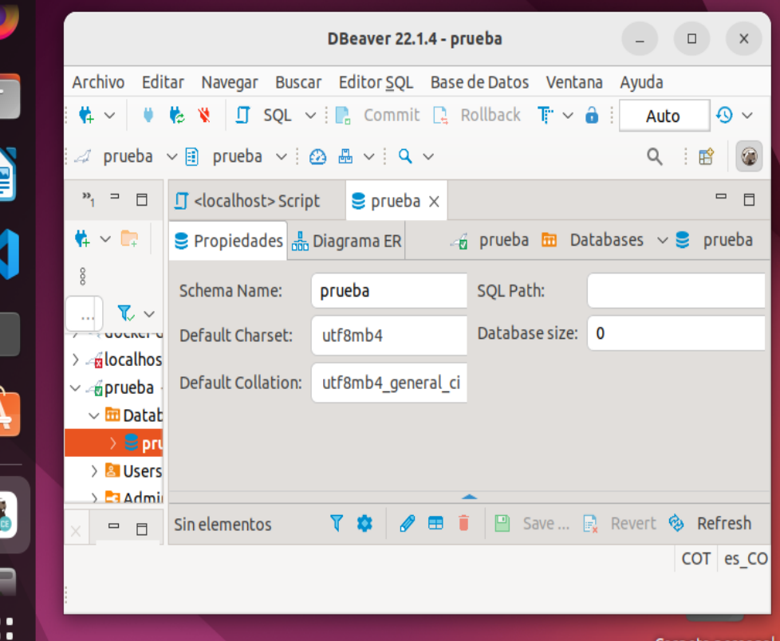
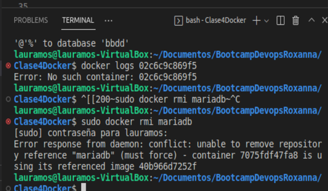

# Pantallazos del ejercicio

1. Creación del contenedor
   
2. conexión al servidor de base de datos con el usuario creado y de la base de datos `prueba` creada automáticamente
   
3. no se puede borrar la imagen `mariadb` mientras el contenedor `bbdd` está creado.
   

4. <ul><li>- [x] <a href=https://github.com/lauramosdim/BootcampDevopsRoxanna/blob/master/Clase4Docker/bootcamp-3-challenge/reto2/crearContenedorbbdd target=_blank>Script</a></li></ul>
