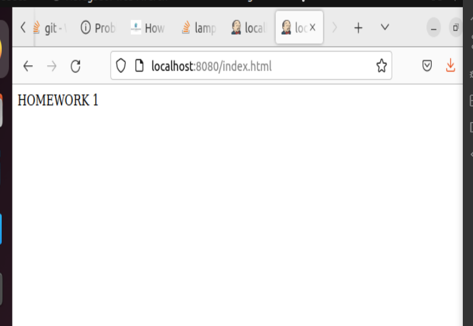

# Pantallazos del ejercicio

1. Crear el fichero Dockerfile.
   
2. Crear un volumen
   
3. Construir la imagen del contenedor.
   
4. Crear el contenedor con nombre 'bootcamp_container' utilizando la imagen construida en el paso 3
   
5. Acceder a la URL http://localhost/8080/index.html
   
